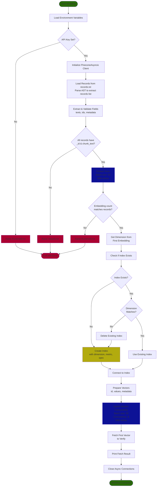

```mermaid
flowchart TD
    Start([Start Workflow]) --> LoadEnv[Load Environment Variables]
    LoadEnv --> CheckAPI{API Key Set?}
    CheckAPI -->|No| Error1[Raise RuntimeError]
    CheckAPI -->|Yes| InitPC[Initialize PineconeAsyncio Client]
    
    InitPC --> LoadRecords[Load Records from records.txt<br/>Parse AST to extract records list]
    LoadRecords --> ValidateRecords[Extract & Validate Fields<br/>texts, ids, metadata]
    
    ValidateRecords --> CheckFields{All records have<br/>_id & chunk_text?}
    CheckFields -->|No| Error2[Raise ValueError]
    CheckFields -->|Yes| EmbedTexts[Embed Texts<br/>Batch size: 32<br/>With retries]
    
    EmbedTexts --> CheckCount{Embedding count<br/>matches records?}
    CheckCount -->|No| Error3[Raise RuntimeError]
    CheckCount -->|Yes| GetDim[Get Dimension from<br/>First Embedding]
    
    GetDim --> CheckIndex[Check if Index Exists]
    CheckIndex --> IndexExists{Index Exists?}
    
    IndexExists -->|No| CreateIndex[Create Index<br/>with dimension, metric, spec]
    IndexExists -->|Yes| CheckDim{Dimension<br/>Matches?}
    
    CheckDim -->|No| DeleteIndex[Delete Existing Index]
    DeleteIndex --> CreateIndex
    CheckDim -->|Yes| SkipCreate[Use Existing Index]
    
    CreateIndex --> ConnectIndex[Connect to Index]
    SkipCreate --> ConnectIndex
    
    ConnectIndex --> PrepareVectors[Prepare Vectors<br/>id, values, metadata]
    PrepareVectors --> UpsertVectors[Upsert Vectors Concurrently<br/>Batch size: 50<br/>Concurrency: 8<br/>With retries]
    
    UpsertVectors --> FetchOne[Fetch First Vector<br/>to Verify]
    FetchOne --> PrintResult[Print Fetch Result]
    PrintResult --> CloseConnections[Close Async Connections]
    CloseConnections --> End([Workflow Complete])
    
    Error1 --> EndError([Exit with Error])
    Error2 --> EndError
    Error3 --> EndError
    
    style Start fill:#2A6C09
    style End fill:#2A6C09
    style EndError fill:#AB0132
    style Error1 fill:#AB0132
    style Error2 fill:#AB0132
    style Error3 fill:#AB0132
    style EmbedTexts fill:#0D1296
    style UpsertVectors fill:#0D1296
    style CreateIndex fill:#B2AB0E
```