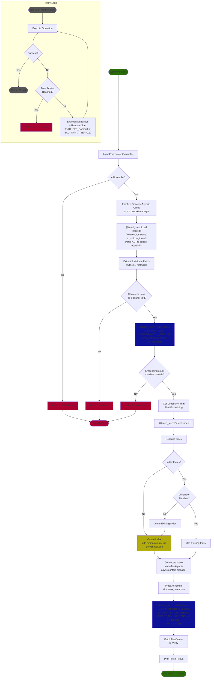

```mermaid
flowchart TD
    Start([Start Workflow]) --> LoadEnv[Load Environment Variables]
    LoadEnv --> CheckAPI{API Key Set?}
    CheckAPI -->|No| Error1[Raise RuntimeError]
    CheckAPI -->|Yes| InitPC[Initialize PineconeAsyncio Client<br/>async context manager]

    InitPC --> LoadRecords["@timed_step: Load Records<br/>from records.txt via asyncio.to_thread<br/>Parse AST to extract records list"]
    LoadRecords --> ValidateRecords[Extract & Validate Fields<br/>texts, ids, metadata]

    ValidateRecords --> CheckFields{All records have<br/>_id & chunk_text?}
    CheckFields -->|No| Error2[Raise ValueError]
    CheckFields -->|Yes| EmbedTexts["@timed_step: Embed Texts<br/>Batched API calls (EMBED_BATCH_SIZE=32)<br/>via pc.inference.embed<br/>with retry logic"]

    EmbedTexts --> CheckCount{Embedding count<br/>matches records?}
    CheckCount -->|No| Error3[Raise RuntimeError]
    CheckCount -->|Yes| GetDim[Get Dimension from<br/>First Embedding]

    GetDim --> EnsureIndex["@timed_step: Ensure Index"]
    EnsureIndex --> CheckIndex[Describe Index]
    CheckIndex --> IndexExists{Index Exists?}

    IndexExists -->|No| CreateIndex[Create Index<br/>with dimension, metric,<br/>ServerlessSpec]
    IndexExists -->|Yes| CheckDim{Dimension<br/>Matches?}

    CheckDim -->|No| DeleteIndex[Delete Existing Index]
    DeleteIndex --> CreateIndex
    CheckDim -->|Yes| SkipCreate[Use Existing Index]

    CreateIndex --> ConnectIndex[Connect to Index<br/>via IndexAsyncio<br/>async context manager]
    SkipCreate --> ConnectIndex

    ConnectIndex --> PrepareVectors[Prepare Vectors<br/>id, values, metadata]
    PrepareVectors --> UpsertVectors["@timed_step: Upsert Vectors<br/>Concurrent batched upserts<br/>(UPSERT_BATCH_SIZE=50,<br/>UPSERT_CONCURRENCY=8 semaphore)<br/>with retry logic"]

    UpsertVectors --> FetchOne[Fetch First Vector<br/>to Verify]
    FetchOne --> PrintResult[Print Fetch Result]
    PrintResult --> End([Workflow Complete])

    Error1 --> EndError([Exit with Error])
    Error2 --> EndError
    Error3 --> EndError

    subgraph Retry Logic
        direction TB
        RetryStart([run_with_retries called]) --> Attempt[Execute Operation]
        Attempt --> Success{Success?}
        Success -->|Yes| RetryEnd([Return Result])
        Success -->|No| MaxRetries{Max Retries<br/>Reached?}
        MaxRetries -->|Yes| RaiseExc[Raise Last Exception]
        MaxRetries -->|No| Backoff["Exponential Backoff<br/>+ Random Jitter<br/>(BACKOFF_BASE=0.5,<br/>BACKOFF_JITTER=0.3)"]
        Backoff --> Attempt
    end

    style Start fill:#2A6C09
    style End fill:#2A6C09
    style EndError fill:#AB0132
    style Error1 fill:#AB0132
    style Error2 fill:#AB0132
    style Error3 fill:#AB0132
    style RaiseExc fill:#AB0132
    style EmbedTexts fill:#0D1296
    style UpsertVectors fill:#0D1296
    style CreateIndex fill:#B2AB0E
    style RetryStart fill:#555555
    style RetryEnd fill:#555555
```
